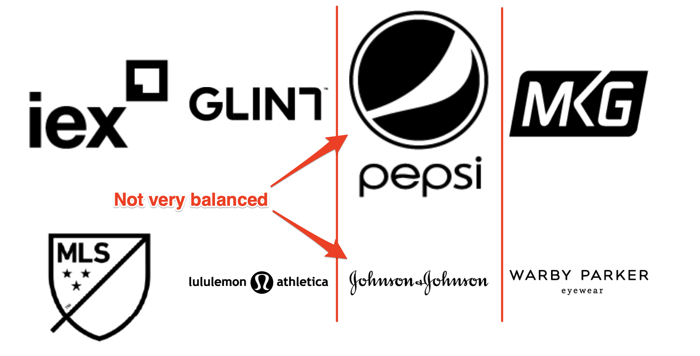

# Logayaut

Drop a bunch of logos and see them place and scale in a beautiful way :)

## The problem

Remember those company sites where you scroll down and see that section _partners_? They say something like "companies that use our services", and they show a list of logos one after another.

Well, now imagine your client wants a section like that (because that's how clients behave, they see something out there and they want the same). So now the graphic designer creates a mockup, it takes them less than 15 minutes. They know how to visually adapt individual sizes so that the whole thing looks balanced. And moving things around in photoshop isn't very complex.

So you have to place tens of logos in a new `div`. And each file they gave you can have a very different size...

### Attempt #1

Place them in a `flex` container, let each logo take the same `width`, like columns. Easy right? :)



Oops... a designer wouldn't have sized the logos like that, I'm pretty sure.

You can also try make them have the same `height` instead, but you can imagine what's gonna happen, right?


### Attempt #2

You try `css grid`, and realize it doesn't make the trick either. Finally you curse the client and the designer and start copying the photoshop by giving **each** image a exact `px` value for `width` and `height`. So sad.

## Solution

If you can't make images have the same width, not the same height, how to visually balance them? Yep, you are right, by **area** :)

So the first thing **logayaut** is gonna do is to make images take the same amount of area.

After that, there's an extra refinement... Designers also do something without realizing: they shrink a bit images that "stain" a lot. Two images occupying the same amount of area can look unbalanced if one is pure black and the other is made of thin lines. That's why **logayaut** calculates the density of the images and tweaks their size according to a shrink factor.


## Installation

````
npm i logayaut
````

## Usage

`logayaout (logos, container, config)`

**logos** : array of images urls

**container** : logos will be rendered inside this html element

**config** : object

>{

>>**area**: max. area in pixels that logos are allowed to take (default: **5000**),

>>**densityShrinkFactor**: factor that represents how much density should impact their shrinking, from 0 (no impact) to 1 (a 100% dense image would result of a size of 0, a 70% dense one would result of 30% of their original size) (default: **.8**),

>>**padding**: Space around logos in the layout (default: **'20px'**)

>}

### Example

````
const logayaut = require('logayaut')

let imgs = ['./img/logo1.png','./img/logo2.png','./img/logo3.png']
let container = document.getElementById('container')

logayaut(imgs, container, 
    {
        area: 7000,
        densityShrinkFactor: 0.6,
        padding: '15px'
    });
````


